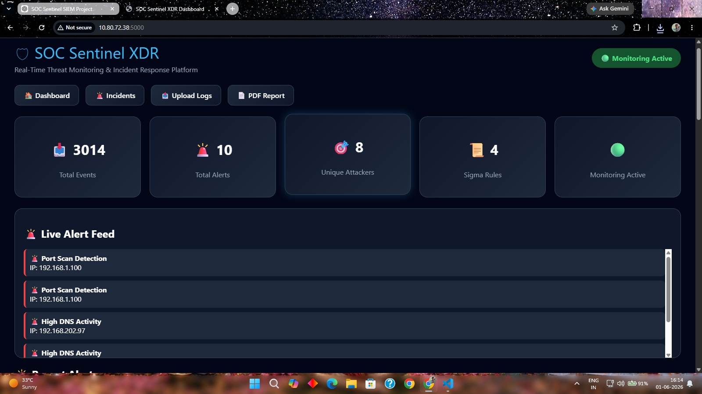
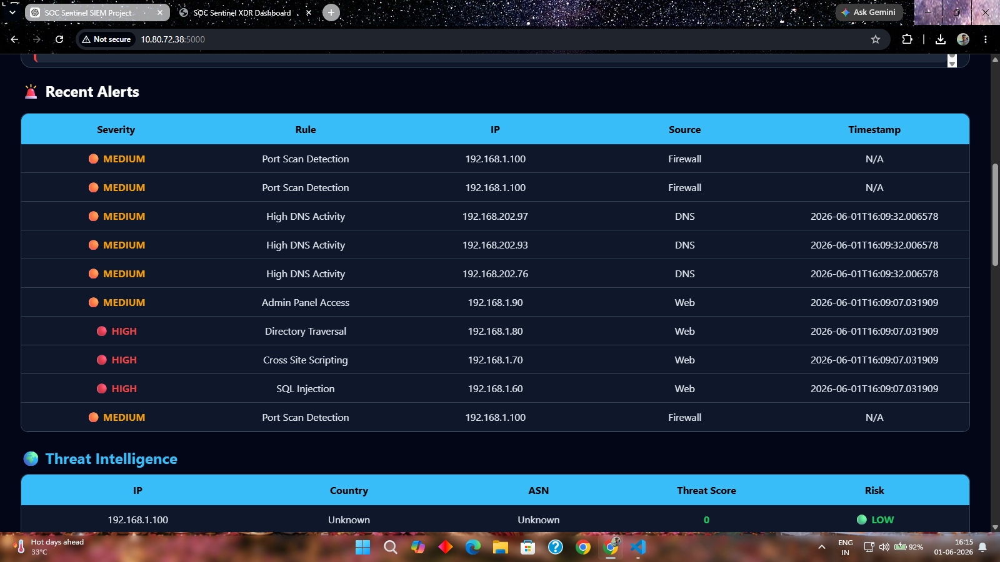
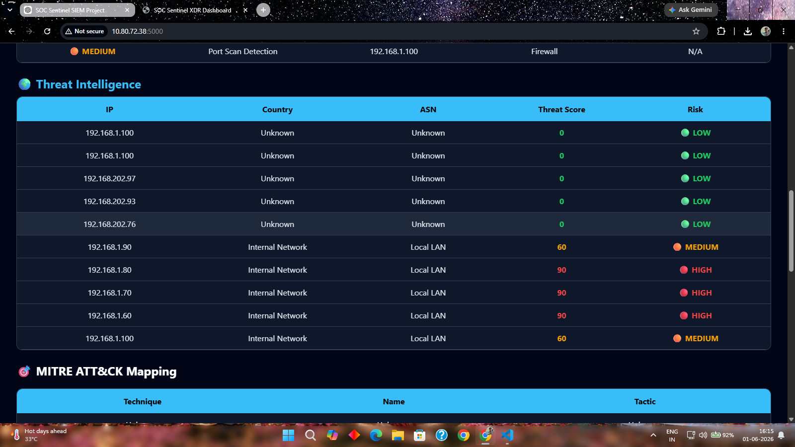
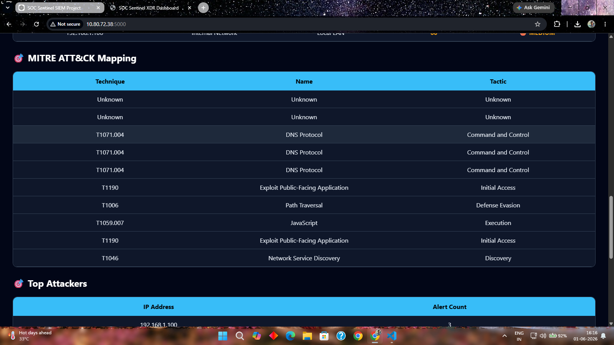
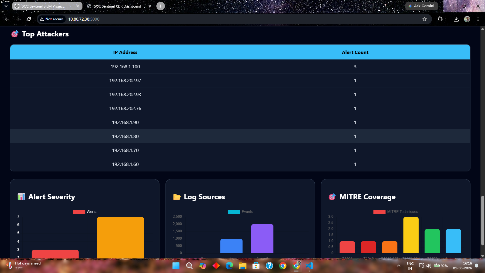
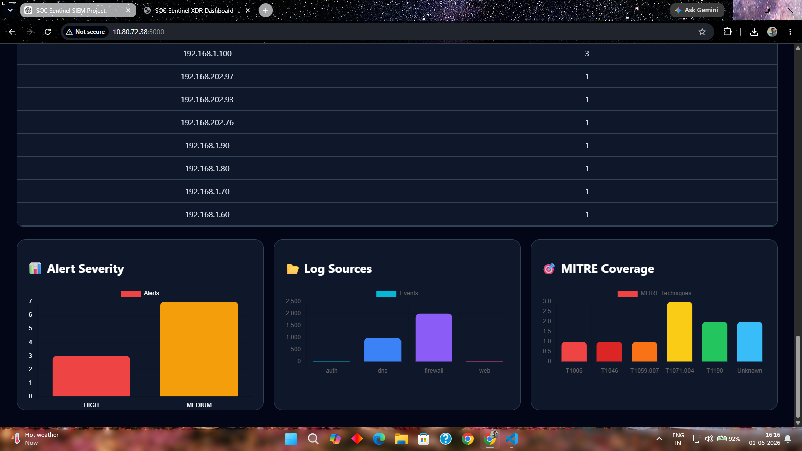
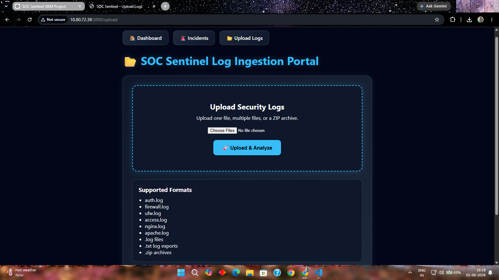

# SOC Sentinel XDR

## Overview

SOC Sentinel XDR is a Security Operations Center (SOC) simulation platform designed to provide real-time threat monitoring, threat detection, incident response, threat intelligence enrichment, MITRE ATT&CK mapping, Sigma rule detection, and security analytics through an interactive dashboard.

---

## Features

### Security Monitoring

* Real-Time Log Monitoring
* Live Alert Feed
* Threat Detection Engine
* Incident Response Workflow
* Security Analytics Dashboard

### Threat Detection

* SSH Brute Force Detection
* Port Scan Detection
* SQL Injection Detection
* Cross-Site Scripting (XSS) Detection
* Directory Traversal Detection
* DNS Threat Detection

### Threat Intelligence

* Risk Scoring
* Threat Score Calculation
* Internal / External IP Classification
* Threat Enrichment
* MITRE ATT&CK Mapping

### Security Operations

* Incident Management
* Alert Correlation
* PDF Security Reporting
* Log Upload & Ingestion
* Live Alert Monitoring

---

## Technology Stack

* Python
* Flask
* Flask-SocketIO
* SQLite
* HTML5
* CSS3
* JavaScript
* Chart.js
* MITRE ATT&CK Framework
* Sigma Rules

---

## Screenshots

### Main Dashboard













---

### Incident Management


---

### Log Upload Portal



---

### Upload Results


---

## Installation

```bash
git clone https://github.com/srgupta6162/SOC-Sentinel-XDR.git

cd SOC-Sentinel-XDR

pip install -r requirements.txt

python app.py
```

---

## Future Enhancements

* User Authentication
* IOC Management
* Case Management
* Threat Hunting Module
* Email Alerting
* SIEM Integration
* Splunk Integration
* Advanced Threat Intelligence Feeds

---

## Author

**Sagar Gupta**

Cybersecurity Enthusiast | SOC Analyst Aspirant | Blue Team Practitioner

LinkedIn: https://www.linkedin.com/in/sagar-gupta-521179262/

GitHub: https://github.com/srgupta6162
